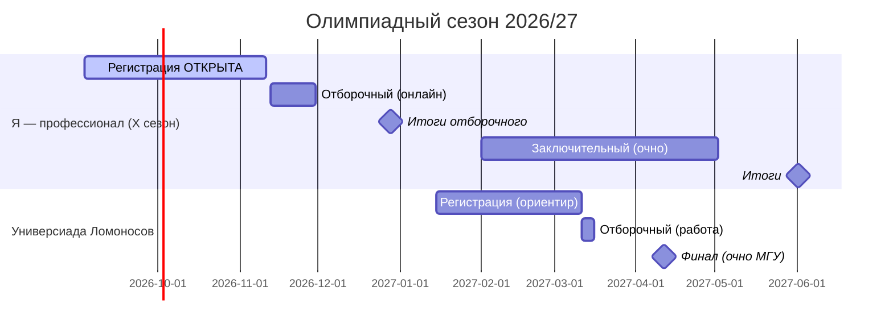

# 🏆 Олимпиады для поступления в магистратуру по ГМУ

> 📢 **Сентябрь 2026: регистрация на «Я — профессионал» X сезон УЖЕ ОТКРЫТА (до 10 ноября)!**

Зачем: диплом победителя/призёра = **100 баллов за вступительное** или поступление вне конкурса (зависит от правил вуза на конкретный год). Это наш главный шанс усилить заявку на бюджет.

> Даты ниже — по сезону 2025/26. Новые календари выходят осенью — **проверить в сентябре–октябре 2026**.

---

## 1. Универсиада «Ломоносов» по государственному управлению (МГУ) ⭐ главная

- Страница: https://spa.msu.ru/students/universiada-lomonosov-po-gosudarstvennomu-upravleniyu/
- Портал заявок: https://universiade.msu.ru
- Кто может: студенты и **выпускники бакалавриата/специалитета** (наш случай!), а также студенты 3 курса.
- Направления: ГМУ и Управление персоналом (выбираешь ОДНО).
- **Сезон 2026 (ориентир):**
  - регистрация: 15 января – 10 марта
  - отборочный этап (заочно, творческая работа): 11–15 марта
  - заключительный этап (очно, ФГУ МГУ): 11 апреля, 3 часа на задание
- Задания соответствуют программе бакалавриата ГМУ = наша подготовка напрямую закрывает эту олимпиаду.
- Результаты учитываются Центральной приёмной комиссией МГУ при поступлении в магистратуру.

### Как готовимся
1. Блоки 1–10 программы = теория.
2. С декабря — разбор заданий прошлых лет (просить меня: «найди задания Универсиады прошлых лет»).
3. Тренируем **письменную структуру ответа**: тезис → понятия → нормативка → пример → вывод.

## 2. «Я — профессионал» по государственному управлению (для магистратуры)

- Портал: https://yandex.ru/profi (направление «Государственное управление», уровень «магистратура»)
- Организатор в направлении: РАНХиГС (ИГСУ). Страница: https://igsu.ranepa.ru/profi/
- Бесплатно, онлайн-отборочный + очный финал.
- **Сезон X (подтверждённый график):**
  - регистрация: 3 сентября — 10 ноября 2026 (ОТКРЫТА)
  - отборочный этап (онлайн-тест): 13–29 ноября 2026
  - итоги отборочного: конец декабря 2026
  - заключительный этап (очно, кейсы): февраль — апрель 2027
  - итоги: май — июнь 2027
- Льготы: при поступлении в магистратуру вузов-партнёров (включая ведущие вузы Москвы). Дипломанты получают 100 баллов / БВИ в зависимости от вуза.
- **Демоварианты прошлых сезонов лежат прямо на портале** (раздел «Подготовка») — прорешать все!

### Как готовимся
1. Отборочный = большой тест по всей теории ГМУ → наши блоки 1–6 к ноябрю закрывают базу.
2. Прорешать демоверсии VII–X сезонов до старта отборочного. Демоверсии X сезона уже доступны!
3. Финал = кейсы → кейсовый трек нашей программы (02_кейсы/).

## 3. Другие варианты (второй эшелон)

| Олимпиада | Кто проводит | Комментарий |
|---|---|---|
| «Высшая лига» | НИУ ВШЭ | льготы в основном в ВШЭ |
| Олимпиады вузов для поступающих в их магистратуру | РГСУ, РУДН и др. | следить за сайтами вузов зимой |
| «Ломоносов» (многопрофильная, для абитуриентов) | МГУ | это про бакалавриат — не наш трек |

---

## 📅 Календарь олимпиадного трека

**Правило:** за 3 недели до каждого этапа — режим интенсива вместо новых тем (см. 00_календарь_года.md).
